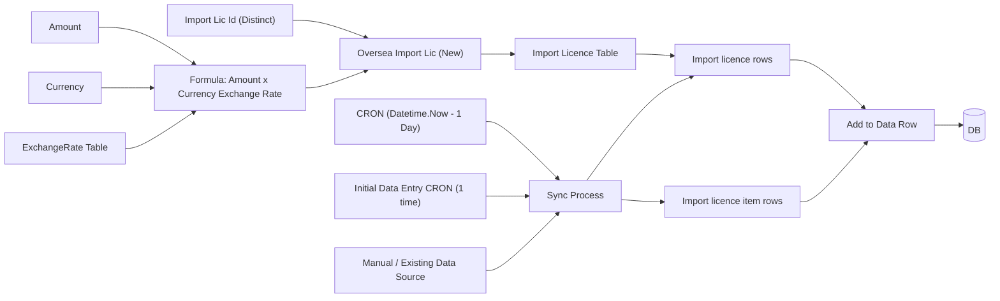

# Overseas Import Licence Sync Flow

Source image:


## Understanding

The diagram appears to describe a sync/import process for **Oversea Import Lic (New)**.

Top-level report/licence categories shown:

- Oversea Import Lic
- Oversea Export Lic
- B I L
- B E L
- O I M
- O E M
- B I M
- B E P

The main data source for the new flow is **Oversea Import Lic (New)**. The process uses a distinct **Import Lic Id** and reads licence data from the Import Licence table.

Amount and Currency are used to calculate a local amount by using the exchange rate from the `ExchangeRate` table.

```text
Formula = Amount x Currency exchange rate from ExchangeRate table
```

The result is then passed through a sync process and added as data rows into the database.

## Process Flow



## Notes

- The sync job should identify records by distinct Import Licence ID.
- The daily CRON appears to process data from the previous day.
- The initial CRON appears to be a one-time data entry/import job.
- Currency conversion should use `ExchangeRate` table data, based on the licence currency.
- Final prepared records are added to a data row structure before saving into DB.
- Some Myanmar labels in the image are not fully clear from the screenshot, so they are represented here as generic import row/item row steps.

## Code Check: ImportLicenecByTotalValueLicenceReport

Checked the new report implementation for the legacy `ImportLicenceByTotalValueLicenceReport.rdlc` flow:

- Frontend page: `Frontend/src/Report/Page/ImportLicenceTotalValueLicencesReport.tsx`
- API controller: `Backend/Controllers/Report/ImportLicenceTotalValueLicencesReportController.cs`
- Main backend summary method: `Backend/StoredProcedureToLinq/sp_ImportLicenceDetailReport_Fast.cs`
- Exchange-rate conversion service: `Backend/Service/Reports/ReportUsdConversionService.cs`
- Import licence item total view: `StoredProcedureMigrations/Views/vw_ImportLicenceItemTotalByCurrency.sql`

Current behavior:

1. `Total Value` table is grouped by currency and sums the original item amount:

   ```text
   TotalValue = SUM(ImportLicenceItem.Amount)
   ```

   The indexed SQL view `vw_ImportLicenceItemTotalByCurrency` groups by:

   ```text
   ImportLicenceId + CurrencyId
   ```

2. `Total USD Value` is the only part that applies exchange-rate conversion.

   The backend gets daily grouped totals, then calls `ReportUsdConversionService.FillDailyUsdValuesAsync`.

3. The exchange-rate formula used by the code is:

   ```text
   USD amount = Amount * (CurrencyRate / USDRate)
   ```

   Special rules:

   ```text
   If Currency = USD:
       USD amount = Amount

   If Currency = JPY or KRW:
       USD amount = Amount * ((CurrencyRate / USDRate) / 100)

   If exchange rate is missing:
       Missing rate defaults to 1
   ```

4. The conversion rate is matched by:

   ```text
   ExchangeRate.Date = LicenceDate
   ExchangeRate.CurrencyId -> Currency.Code
   ```

5. Therefore, based on current code, the report does **not** convert every `Total Value` row into MMK or USD. It only uses exchange rate for the final `Total USD Value`.

If the expected new workflow is:

```text
Amount x Currency exchange rate from ExchangeRate table
```

then that is closer to MMK conversion:

```text
MMK amount = Amount * CurrencyRate
```

That is different from the current report's USD conversion:

```text
USD amount = Amount * (CurrencyRate / USDRate)
```
